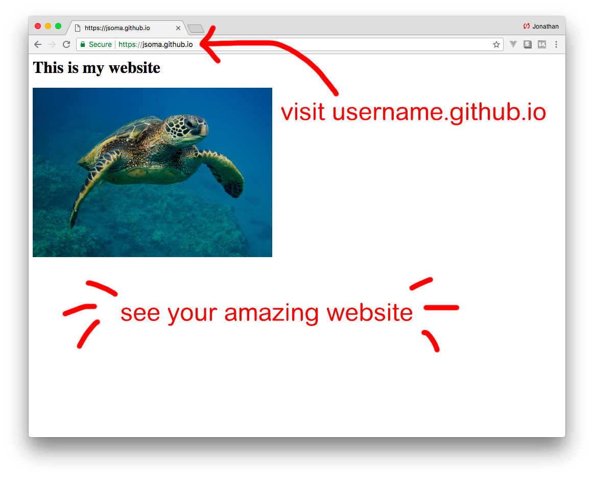

# How to host a website on GitHub pages

## (with little text and lots of screenshots)

### Create a new repository

Name is `username.github.io`. My username is `jsoma`, so my repository is called `jsoma.github.io`.

### Clone the repository to your machine

### Create your web site

In the directory you cloned your repository to, add an `index.html` (it's a magic filename, be sure to use it) and any images you might need.

Open your HTML file in the browser to make sure it looks nice.

### Send your changes back to GitHub

### Wait for a few minutes

Sip your coffee and think about the state of the world for a moment or two.

### Visit `yourusername.github.io`

Make sure you're looking at `.io`, not `.com`! If you don't have a website yet, 

* Make sure you named your file `index.html`
* Make sure you named your repository correctly (I'm `jsoma`, so mine is called `jsoma.github.io`)
* Sit still for another 10 minutes and check again, sometimes it takes a little time.

### Upgrading your sweet website

You *could* add some more files for each of your projects - `birds.html` for your project about birds, `air-quality.html` for your project on Beijing's air quality, `earthquakes.html` for your project about earthquakes....... **but that looks kind of silly**.

We'd rather have `jsoma.github.io/turtles/` instead of `jsoma.github.io/turtles.html`, right? Looks cleaner?

**It's easy to do**, we just have to take advantage of `index.html` being automatically given to your browser when you visit a directory.

### Create a new folder for your project, put an index.html inside

This is your new project file

### Make sure everything looks okay on your machine

Now your first `index.html` file is a 'welcome to my website' file, and your `turtles/index.html` (or whatever) file is your project file about turtles.

Be sure to move your images into the directory!!!

### Send it to GitHub, wait a few minutes, have a party about your new website

